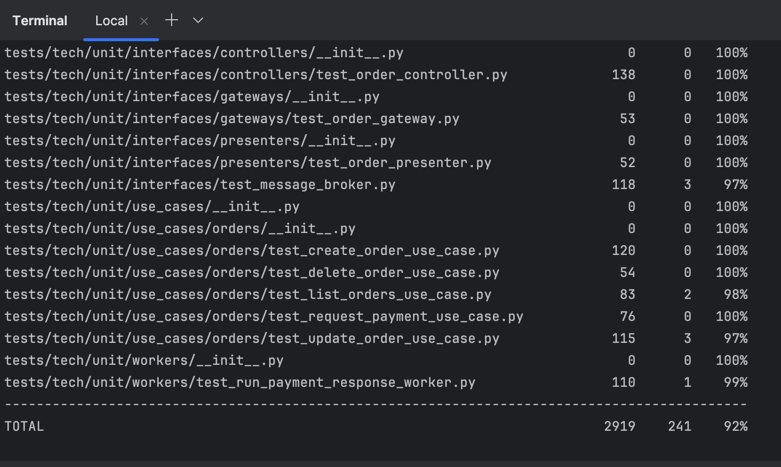
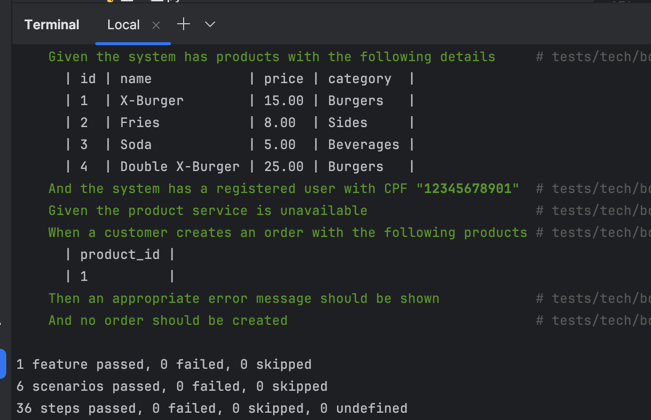
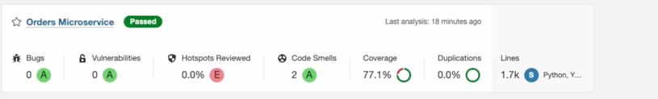

# Microsserviço de Pedidos

Este repositório contém o microsserviço de pedidos, responsável por gerenciar o ciclo de vida de pedidos na plataforma, incluindo criação, atualização de status e integração com o serviço de pagamentos.

## Tecnologias

- **Framework**: FastAPI
- **Linguagem**: Python 3.10+
- **Banco de Dados**: PostgreSQL
- **Mensageria**: RabbitMQ
- **Testes**: Pytest + Coverage
- **Padrões**: Clean Architecture, Circuit Breaker

## Estrutura do Projeto

```
tech/
├── api/
│   └── order_router.py
├── domain/
│   └── entities/
│       └── order.py
├── infra/
│   ├── databases/
│   │   └── database.py
│   ├── factories/
│   │   ├── product_gateway_factory.py
│   │   └── user_gateway_factory.py
│   ├── gateways/
│   │   └── order_gateway.py
│   └── rabbitmq_broker.py
├── interfaces/
│   ├── controllers/
│   │   └── order_controller.py
│   ├── gateways/
│   │   └── order_gateway.py
│   ├── message_broker.py
│   └── schemas/
│       └── order_schema.py
└── use_cases/
    └── orders/
        ├── create_order_use_case.py
        ├── delete_order_use_case.py
        ├── list_orders_use_case.py
        ├── request_payment_use_case.py
        └── update_order_status_use_case.py
```

## Configuração do Ambiente

### Requisitos

- Python 3.10+
- PostgreSQL 13+
- RabbitMQ 3.8+

## Banco de Dados

### Modelo de Dados

```sql
CREATE TABLE orders (
    id SERIAL PRIMARY KEY,
    user_cpf VARCHAR(11) NULL,
    status VARCHAR(20) NOT NULL DEFAULT 'pending',
    total_price DECIMAL(10, 2) NOT NULL,
    created_at TIMESTAMP NOT NULL DEFAULT NOW(),
    updated_at TIMESTAMP NOT NULL DEFAULT NOW()
);

CREATE TABLE order_items (
    id SERIAL PRIMARY KEY,
    order_id INTEGER NOT NULL REFERENCES orders(id) ON DELETE CASCADE,
    product_id VARCHAR(36) NOT NULL,
    quantity INTEGER NOT NULL DEFAULT 1,
    unit_price DECIMAL(10, 2) NOT NULL,
    UNIQUE (order_id, product_id)
);
```

## Endpoints da API

| Método | Endpoint | Descrição |
|--------|----------|-----------|
| GET | `/` | Lista todos os pedidos |
| GET | `/{order_id}` | Obtém detalhes de um pedido específico |
| POST | `/checkout` | Cria um novo pedido |
| PUT | `/{order_id}` | Atualiza o status de um pedido |
| DELETE | `/{order_id}` | Remove um pedido |
| POST | `/{order_id}/request-payment` | Inicia o processamento de pagamento |

## Integração com Outros Serviços

O microsserviço de pedidos se integra com:

1. **Serviço de Produtos**: Para validar disponibilidade e obter informações atualizadas dos produtos
2. **Serviço de Usuários**: Para validar dados do usuário ao criar pedidos
3. **Serviço de Pagamentos**: Para processar os pagamentos dos pedidos

### Resilience Patterns

O microsserviço implementa o padrão Circuit Breaker para aumentar a resiliência nas chamadas para os serviços externos:

- Evita sobrecarga de serviços já indisponíveis
- Falha rapidamente quando serviços dependentes estão indisponíveis
- Recuperação gradual com estado "half-open"

## Fluxo de Pagamento

1. Cliente cria um pedido via `/checkout`
2. Pedido é criado com status `PENDING`
3. Cliente solicita pagamento via `/{order_id}/request-payment`
4. Uma mensagem é enviada para a fila do RabbitMQ
5. O microsserviço de pagamentos processa a solicitação
6. O status do pedido é atualizado após o processamento do pagamento

## Testes

### Executando Testes Unitários

```bash
# Execute todos os testes
pytest

# Execute testes com cobertura
pytest --cov=tech tests/

# Gere relatório HTML de cobertura
pytest --cov=tech --cov-report=html tests/
```

### Executando Testes BDD

O projeto utiliza testes BDD (Behavior-Driven Development) com o framework Behave para validar os requisitos de negócio de forma clara e compreensível.

```bash

cd tech 
# Execute todos os testes BDD
behave tests/tech/bdd/features/

# Execute um cenário específico
behave tests/tech/bdd/features/orders.feature

# Execute testes com tags específicas
behave tests/tech/bdd/features/ --tags=checkout,payment

# Execute e gere relatório em formato JUnit (para integração com CI/CD)
behave tests/tech/bdd/features/ --junit
```

#### Exemplo de Cenário BDD

```gherkin
Feature: Processamento de pedidos
  Como um cliente
  Eu quero criar um pedido com produtos
  Para que eu possa finalizar minha compra

  Scenario: Criar um pedido com produtos válidos
    Given que existem produtos disponíveis no catálogo
    When eu crio um pedido com os produtos "1,2,3"
    Then o pedido deve ser criado com sucesso
    And o status do pedido deve ser "RECEIVED"
    And o preço total deve ser calculado corretamente
```

### Cobertura de Testes







> **Nota**: A imagem acima mostra a estrutura de diretórios dos testes, incluindo a organização dos testes BDD que seguem o padrão de features e steps.
